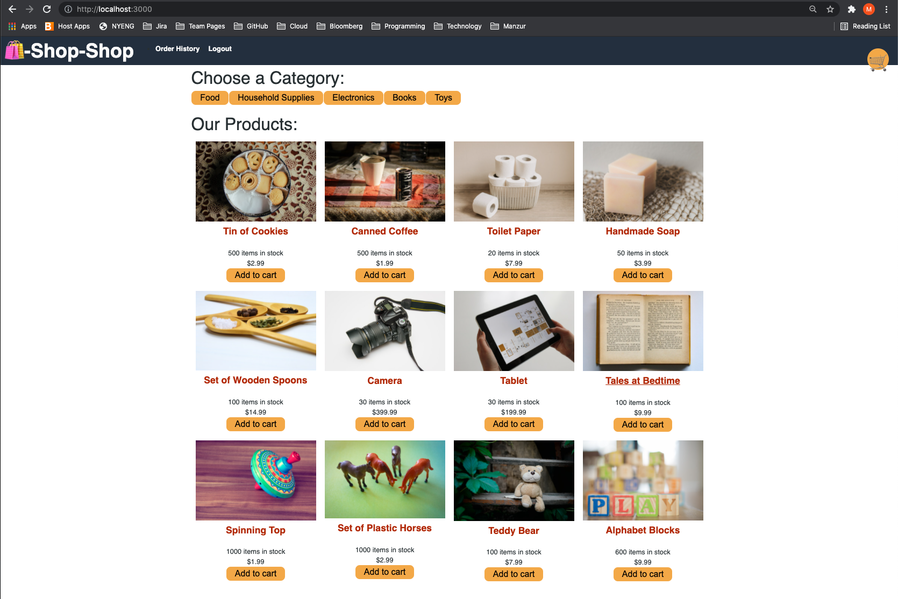

# ms-redux-state


A refactored e-commerce platform that uses redux.

## Installation

Code: [Code](https://github.com/manzur-shaheed/ms-redux-state) 

You can clone code from [github link](https://github.com/manzur-shaheed/ms-redux-state) and run it locally on your computer. 

#### Deployed
This application is deployed at this [link](https://ms-redux-state.herokuapp.com/) on heroku.
#### Prerequisites 
A computer with ```mongodb``` database installed locally, ```node.js``` and ```npm``` (node package manager). It uses following ```node.js``` packages -
- express
- mongoose
- Node.js
- bcrypt
- jsonwebtoken
- various react packages
- apollo server/graphql

To clone code from github, you need to have aceess to the Internet. Also your computer should have Terminal (Unix) software installed. For Windows users, you can get it from https://www.cygwin.com/. For Mac users, it comes pre-installed with MacOS. 

#### Installing and running 
- Open a terminal.
- Create a directory for this project.
- Change current directory to this project direcory.
- Issue the following command -
```
git@github.com:manzur-shaheed/ms-redux-state.git
```
- If you don't have ```node.js``` installed already then download it from [here](https://nodejs.org/en/download/), and follow the instructions to install it.
- Once installed, use ```npm``` to install node packages listed above by issuing ```npm i <package>``` command at the terminal prompt.
- Follow instruction at 
  * [Deploy with Heroku and MongoDB Atlas](https://coding-boot-camp.github.io/full-stack/mongodb/deploy-with-heroku-and-mongodb-atlas).

Sample run -


## License
MIT License

Copyright (c) 2021 Manzur Shaheed

Permission is hereby granted, free of charge, to any person obtaining a copy of this software and associated documentation files (the "Software"), to deal in the Software without restriction, including without limitation the rights to use, copy, modify, merge, publish, distribute, sublicense, and/or sell copies of the Software, and to permit persons to whom the Software is furnished to do so, subject to the following conditions:

The above copyright notice and this permission notice shall be included in all copies or substantial portions of the Software.

THE SOFTWARE IS PROVIDED "AS IS", WITHOUT WARRANTY OF ANY KIND, EXPRESS OR IMPLIED, INCLUDING BUT NOT LIMITED TO THE WARRANTIES OF MERCHANTABILITY, FITNESS FOR A PARTICULAR PURPOSE AND NONINFRINGEMENT. IN NO EVENT SHALL THE AUTHORS OR COPYRIGHT HOLDERS BE LIABLE FOR ANY CLAIM, DAMAGES OR OTHER LIABILITY, WHETHER IN AN ACTION OF CONTRACT, TORT OR OTHERWISE, ARISING FROM, OUT OF OR IN CONNECTION WITH THE SOFTWARE OR THE USE OR OTHER DEALINGS IN THE SOFTWARE.
## Contacts
#### Github
- [Manzur Shaheed](https://github.com/manzur-shaheed/)
#### Email
- [Manzur Shaheed](mailto:shaheed_manzur@yahoo.com)
## Acknowledgements
* **Billie Thompson** - [PurpleBooth](https://github.com/PurpleBooth) for the README Template.
* [Bootcamp Unit 22 Homework Readme](https://columbia.bootcampcontent.com/columbia-bootcamp/cu-nyc-virt-fsf-pt-03-2021-u-c/-/tree/master/22-State/02-Homework).


